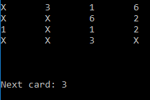
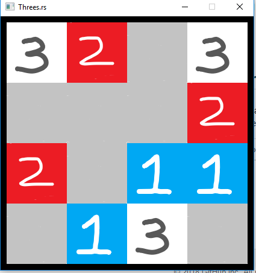

# threes.rs

A clone of my favourite game, [Threes](http://asherv.com/threes/). Can be played on a UI, or through the terminal!

Terminal:

GUI:

## How to play:

Enter W, A, S or D to move tiles up, left, down or right respectively. Pressing any of these will move the entire board to the left. 

It's probably best to play this in a fresh terminal, or one that you don't mind having repeatedly wiped.

Rules:
- Making a move moves the whole board in that direction if possible
- A 1 tile can collide with a 2 tile to make a 3 tile
- Tiles with the same value join together to make a new tile with double the values, e.g. a collision between two 6 tiles makes one 12 tile
- A new semi-random value will then join the board

Have fun!

Also you should really go buy the game, it's far better
